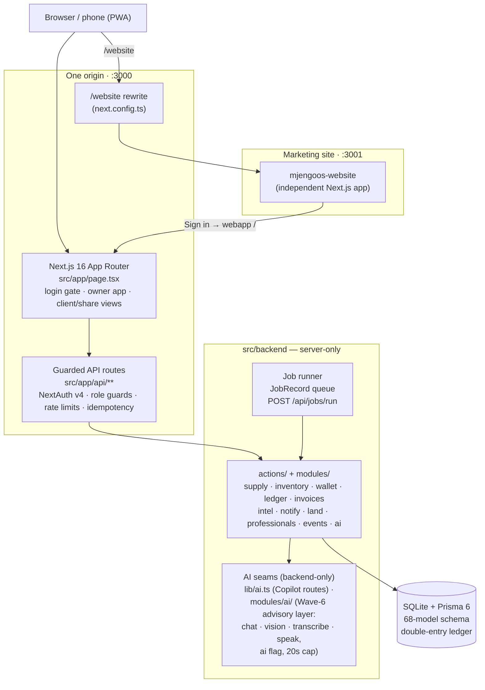

# MjengoOS — Construction Site OS 🇰🇪

> **The evidence-backed operating system for a construction project — from
> land verification and planning, through procurement and physical execution,
> to payments, completion, and handover.**

MjengoOS is an **offline-first Construction Operating System** built for Kenya
and the wider African market. It connects **clients, contractors, project
managers, site supervisors, quantity surveyors, procurement teams, suppliers
and financial records** around one source of truth for a build — and it is
designed for the way sites actually work: messy, distributed, cash-heavy and
often offline.

Concretely: phase budgets on a double-entry ledger, escrow-backed milestones
released against photo proof, **MjengoScore** (an evidence-derived contractor
trust score), hash-stamped **evidence draw packs** for diaspora clients, an
**advisory AI layer** that describes and never approves, `*384#` USSD and
WhatsApp attendance for feature phones, and share links that let clients
abroad watch their build without an account.

[](https://nextjs.org)
[](https://www.typescriptlang.org)
[](https://tailwindcss.com)
[](https://www.prisma.io)
[](https://bun.sh)
[](https://vitest.dev)
[](./LICENSE)

**Philosophy:** *don't just record what people say happened — record the
evidence around what happened.* Reported vs verified, everywhere. **The
physical world is the source of truth; software should capture, verify,
reconcile and explain it.** The ledger never lies; AI never approves; payments
are idempotent; closing stock is always derived.

## Contents

- [Why MjengoOS?](#why-mjengoos) · [Core principles](#core-principles--enforced-not-aspirational) · [The project lifecycle](#the-project-lifecycle--land-to-handover)
- [The product in one page](#the-product-in-one-page) · [Visual tour](#visual-tour) · [Demo accounts](#demo-accounts-seed-data) · [Feature tour](#feature-tour-the-real-tabs) · [The AI surface](#the-ai-surface-honest-by-design)
- [Architecture](#architecture) · [Tech stack](#tech-stack) · [Quick start](#quick-start) · [Environment variables](#environment-variables)
- [Security engineering](#security-engineering) · [i18n](#i18n--english--kiswahili) · [Deployment](#deployment) · [CI/CD](#cicd) · [Honesty notes](#honesty-notes-deliberate)
- [Kenya-first, Africa-ready](#kenya-first-africa-ready) · [Project structure & docs](#project-structure--docs) · [Contributing](#contributing) · [License](#license)

## Why MjengoOS?

Construction management software usually assumes reliable internet,
smartphones for everyone, accurate manual reporting, centralized teams, clean
procurement and trustworthy inventory updates.

Real construction sites don't work that way: intermittent connectivity,
supervisors working from phones, fundis without smartphones, materials from
multiple hardware stores with handwritten invoices, cash and mobile-money
transactions, changing quantities, remote clients, multiple subcontractors —
and project truth scattered across WhatsApp, paper, spreadsheets and
conversations. MjengoOS is designed around those constraints rather than
pretending them away. Nothing becomes system truth just because someone
typed it into a form: every important event follows the same shape —
**reported → evidence captured → verified → recorded** — and the platform
preserves each step of that distinction.

## Core principles — enforced, not aspirational

Architectural invariants, pinned by tests where noted — not marketing promises.

1. **Evidence first — reported ≠ verified.** A supervisor saying 500 bags of
   cement arrived is a *report*; a delivery carrying supplier, PO, quantity,
   timestamp, location, delivery note, photos, receiver and proof of delivery
   is *evidence*. The distinction is kept everywhere: attendance has
   verified / reported / exception levels (payroll gates on verification),
   deliveries are counted per line (ordered 50 / received 48 = discrepancy),
   land searches are *recorded*, never claimed registry-confirmed, and
   MjengoScore is computed only from evidence rows.
2. **AI never approves.** AI analyzes, classifies, extracts, recommends and
   flags; it cannot approve payments, purchases, inventory adjustments,
   contractual changes or milestone completion. Advisory notes gate nothing
   (grep-pinned non-influence tests); the human decision columns
   (`reviewedBy`/`decidedBy` …) exist in the schema and nothing writes them.
3. **The ledger never lies.** Financial truth lives in an immutable
   double-entry ledger: every posted transaction balances; corrections are
   compensating entries (reversals), never edits; the escrow balance is
   computed from ledger entries, never a stored projection; audit and AI rows
   are append-only.
4. **Payments are idempotent.** Retries, duplicated callbacks, provider
   timeouts and offline replays must never turn one payment into two: payment
   routes dedupe through `IdempotencyRecord` rows + `Idempotency-Key` headers;
   offline sync dedupes by outbox id (a lost response can't double-post); the
   Daraja sandbox reconcile sweep re-drives the *same* callback processor —
   never a second money path.
5. **Closing stock is always derived.** `opening + verified receipts +
   approved adjustments − verified issues − consumption − transfers =
   closing stock`. The Site Store is an append-only movement ledger, closing
   stock is computed from it, and a consumption that would project negative
   stock is rejected **before** anything persists.
6. **Offline is a first-class state.** Offline is a normal operating mode:
   mutations queue in a persisted outbox; on reconnect they sync, validate
   and resolve conflicts per item (surfaced, never silently dropped); the
   installable PWA never caches `/api/*` — no stale money or evidence.

## The product in one page

| | |
|---|---|
| **Marketing site** (`/website`) | The public pitch: what MjengoOS is, who it's for, pricing, security. |
| **Web app** (`:3000`) | The product: login gate → role-aware workspace with 14 tabs, offline outbox, PWA. |
| **Mobile shell** | Same app, phone-first: bottom nav (≤5 tabs + More sheet + camera quick-action). |
| **Client share links** | `/?share=<token>` — diaspora clients approve milestones, comment on photos, decide invoices. No account. The token is the auth. |

### Visual tour

**The marketing website** (`/website`, served by the web app's origin — one
URL for the whole product):


**Sign-in gate** — every demo role is one tap away:


**Overview** — Day 47 · 37% complete · KSh 727K / KSh 4.5M budget burn-down,
Project Health, alerts, daily recap, report exports:


**Money** — MjengoPay escrow on a double-entry ledger: KSh 1.2M in escrow,
milestones with proof-of-work gates, variation orders, payment requests,
balanced ledger view:


**Money → evidence draw pack** — the proof freezes the moment money moves: an
immutable, SHA-256-stamped bundle of evidence photos, ledger reference, open
variations, attendance window and the MjengoScore at release:


**Money → AI draw review** (flag-gated, advisory-only) — a vision + LLM pass
over the frozen pack's photos and context produces a confidence-labeled
advisory note; the approval click stays human:


**Evidence → authenticity screen** — perceptual-hash duplicate detection
("this photo paid for the foundation AND the slab") plus a vision
phase-consistency pass; every flag is advisory and source-labeled rule vs AI:


**Intel → trust digest** — a weekly "what your money did" digest whose every
number is a ledger row (deterministic text, English + Kiswahili), read aloud
as a voice note through the share link:


**Materials** — Site Store append-only stock ledger with derived closing
stock, delivery log, consumption:


**Evidence** — the Bias-Free Ledger: append-only audit of every action with
actor, IP, user-agent and request id:


**Intel → MjengoScore** — a deterministic 0–100 contractor trust score
computed from the project's evidence rows, with per-component deductions and
an honest "describes, humans decide" label:


**Phone-first** (`src/mobile` bottom nav) and the ⌘K command palette:

<p>
  
  
</p>

## Demo accounts (seed data)

Seeded by `prisma/seed-extras/users.ts` so the full role matrix is explorable
immediately. **These are intentional demo seeds, not real credentials.**

| Email | Password | Role | Landing tab |
|---|---|---|---|
| `contractor@mjengo.os` | `mjengo2026` | Contractor — full owner app | Overview |
| `client@mjengo.os` | `mjengo2026` | Client — read-only "Virtual Site Visit" + decisions | Overview |
| `supplier@mjengo.os` | `supplier2026` | Supplier — scoped supplier portal (quotes to answer, orders to confirm/dispatch, invoices, catalog) | Supplier |
| `admin@mjengo.os` | `admin2026` | Admin — owner app + feature flags + Audit tab | Overview |
| `finance@mjengo.os` | `mjengo2026` | Finance — payment approvals, wallet ops, `/api/v1` | Money |
| `supervisor@mjengo.os` | `mjengo2026` | Site Supervisor — site operations + evidence | Overview |
| `procurement@mjengo.os` | `mjengo2026` | Procurement — closed-loop supply chain | Finder |
| `qs@mjengo.os` | `mjengo2026` | Quantity Surveyor — BOQ, materials, costs | Materials |

A **supplier** demo account ships with the Wave-5 supplier portal (shipped —
see the supplier row in the feature tour).

Diaspora clients with a **share link** need no account at all. Owner APIs are
guarded server-side (401/403); client roles and share tokens can only run an
explicit allowlist of actions (`src/shared/client-actions.ts` — approve
milestones/variations/payment requests, decide client-band material requests,
pay invoices, comment on photos, read notifications). Supplier accounts
(`supplier@mjengo.os` above) run their own allowlist
(`src/shared/supplier-actions.ts` — answer their quotes, confirm/dispatch
their orders, maintain their catalog) pinned server-side to their linked
Supplier row.

## Feature tour (the real tabs)

| Tab | What a user gets |
|---|---|
| **Overview** | KPIs, budget burn-down vs plan, **Project Health** (6 transparent dimensions with a "how this is computed" breakdown), digital-twin time-lapse, interactive site map, alerts, daily recap, **report exports** (Daily/Weekly/Financial/Procurement CSV + Weekly PDF), photo evidence with comment threads |
| **Site Plan** | Phases → tasks, progress sliders, task priorities/assignees/blockers |
| **Materials** | Inventory, delivery log (voice or manual), consumption, **Site Store** — append-only stock-movement ledger (opening/received/consumed/transferred/returned/damaged/adjusted) with derived closing stock + CSV export |
| **Finder** | Procurement closed loop: BOQ → approval-rules engine (role bands, auto-approve within limit, chained client+finance over 250K) → RFQ + multi-line quotes → landed-cost comparison → PO lifecycle → **delivery verification** (per-line counts, damage, GPS, photos — ordered 50 / received 48 = discrepancy) → auto-posted Site Store movements → supplier invoices w/ client decision queue → **3-way match** (PO ↔ invoice ↔ delivery) → payments. Supplier directory + saved shortlists + price-history chips |
| **Fundis** | **Workforce Trust**: verified vs reported vs exception attendance levels, daily muster roll, payroll gated on verification, kiosk PINs, check-in via app/USSD/kiosk QR, CSV export |
| **Money** | **MjengoPay escrow on a double-entry ledger** (simulated money, real workflow): top-ups post balanced entries, milestone releases gated on photo proof, variation orders, payment requests with chained approval, reversals (history is never edited), cost codes, `PaymentProvider` seam (Daraja sandbox when configured), **evidence draw packs** — immutable, hash-stamped proof bundles frozen at every milestone release, served (and printable) through the revocable client share link — and a flag-gated **"Run AI review"** button on released milestones that appends an advisory note to the pack |
| **Land** | Parcels + title-deed transcriptions, registry-search requests with deterministic consistency check, review gate, parcel timelines, printable **Property Passport**, professionals directory with verification ladder — honest: searches are recorded, not registry-confirmed |
| **Evidence** | **Bias-Free Ledger** — append-only audit of every action with actor, IP, user-agent, request id and entity context; filters, anomaly feed, PDF reports; the **authenticity screen** — perceptual-hash duplicate detection + vision phase-consistency over evidence photos (advisory flags, source-labeled rule vs AI, flag-gated) |
| **Intel** | Deterministic risk rules (weighted 5-rule score), **MjengoScore** — the contractor trust score derived from evidence rows (six traceable components, append-only history, gates nothing), weekly digest, regional price trends, supplier reliability from actual transactions, **background jobs** (anomaly scan, digest, reconciliation, overdue check), and the **AI trust digest** — a weekly EN/Swahili "what your money did" digest composed from ledger rows with an optional TTS voice note |
| **AI Copilot** | Vision photo analysis (phase, PPE, material counts) with a working upload pipeline, Swahili voice-to-invoice, anomaly scan — behind the `ai_progress` feature flag; the Wave-6 advisory layer (draw review, authenticity, trust digest) rides its own `ai` flag — see [The AI surface](#the-ai-surface-honest-by-design) |
| **Field channels — USSD + WhatsApp** | `*384#` muster-line simulation (menu → PIN → present/absent) dispatching real attendance records, plus the **WhatsApp field line**: workers text `PRESENT` / `ABSENT` / `HALF` / `BALANCE` or free text — the webhook contract is documented (`GET /api/whatsapp`), replies are footered "MjengoOS sim", and attendance + photo notes land through the same domain appliers the app uses (no Meta Cloud API wired — an honest seam) |
| **Audit** | Admin-only drill-down into the full audit trail (contractors and clients don't see it) |
| **Settings** | Profile, language (English/Kiswahili), local preferences, notification prefs — per-user, every role |
| **Supplier** (supplier role only) | The supply side of the marketplace: scoped portal — RFQs waiting for their price, sent POs to confirm, confirmed orders to dispatch (writes the same delivery records the buyer verifies), their invoices with honest statuses, their catalog exactly as buyers' comparisons see it. Every read/mutation is server-pinned to the linked Supplier row (foreign ids → the same error as a miss) |

**Role matrix** (mirrors `src/shared/permissions.ts` ↔ `src/backend/lib/guard.ts`):

| Tab | Contractor | Admin | Supervisor | Finance | Procurement | QS | Client | Supplier |
|---|:--:|:--:|:--:|:--:|:--:|:--:|:--:|:--:|
| Overview | ✅ | ✅ | ✅ | ✅ | ✅ | ✅ | ✅ | — |
| Site Plan | ✅ | ✅ | ✅ | — | — | ✅ | ✅ | — |
| Materials | ✅ | ✅ | ✅ | — | ✅ | ✅ | ✅ | — |
| Finder | ✅ | ✅ | ✅ | ✅ | ✅ | ✅ | ✅ | — |
| Fundis | ✅ | ✅ | ✅ | — | — | — | ✅ | — |
| Money | ✅ | ✅ | — | ✅ | — | — | ✅ | — |
| Land | ✅ | ✅ | — | — | — | — | ✅ | — |
| Evidence | ✅ | ✅ | ✅ | ✅ | ✅ | ✅ | ✅ | — |
| Intel | ✅ | ✅ | — | — | — | — | ✅ | — |
| AI Copilot | ✅ | ✅ | ✅ | — | — | — | — | — |
| USSD | ✅ | ✅ | ✅ | — | — | — | ✅ | — |
| Audit | — | ✅ | — | — | — | — | — | — |
| Settings | ✅ | ✅ | ✅ | ✅ | ✅ | ✅ | ✅ | ✅ |
| Supplier portal | — | — | — | — | — | — | — | ✅ |

Unknown roles fail closed (one safe tab + an honest notice), client-side and
server-side, in the same commit.

**Also in the box:** multi-project workspace with global search (⌘K palette
navigates tabs, switches projects, runs quick actions), offline-first sync
(persisted outbox, server-side dedupe by outbox id — a lost HTTP response can
never double-post money), Data Saver photo downscaling, installable PWA
(`/api/*` is never cached — no stale money or evidence), notification center
with honest `deliveryStatus: logged` state, and a feature-flag system that
actually closes its feature when off — on `/api/actions`, per-item on the
offline `/api/sync` drain, and by allowlist on the share link.

## The AI surface (honest by design)

Wave 6 added an advisory AI layer over the evidence substrate. The design
goal was not "AI features" — it was **AI output a bank could read without
trusting the model**:

- **One seam, flag-gated, dark by default.** Every Wave-6 feature calls
  `AiProvider` (`src/backend/modules/ai/` — chat / vision / transcribe /
  speak) resolved through `resolveAiProvider(flags)`. The `ai` flag ships
  **DEFAULT OFF**; an admin opts in through the flags popover, and a flag-off
  install never contacts the SDK (test-pinned: `sdk.create` call count 0).
- **Advisory only — AI never approves.** Draw-review notes and authenticity
  insights gate nothing: no action, ledger path or release ladder reads them
  (grep-pinned non-influence tests). The human decision columns
  (`reviewedBy`/`decidedBy` …) exist in the schema and nothing writes them.
- **No model-authored numbers.** Every digit run the model emits is redacted
  before storage (`redactModelFigures`); the trust-digest text is composed
  deterministically from ledger rows in EN + Kiswahili — the model only reads
  it aloud (TTS), never authors it. Every digest figure traces to a row.
- **Honest failure states, never a fake analysis.** Provider unreachable,
  timeout (20s per-call cap), empty or unparseable answers → `{ ok: false }`
  leak-free errors and **no row written**; a failed TTS leg degrades the audio,
  never the digest text (verified live: the Kiswahili voice timed out honestly
  and the text survived).
- **Append-only, like everything else here.** `AiReviewNote`, `PhotoHash`,
  `AiInsight` and `TrustDigest` rows are append-only (no update/delete path
  exists anywhere), latest wins, full history kept.
- **Real, measured, live.** With the flag on and `.z-ai-config` present (the
  SDK self-configures — **no new env vars**), the same models answer the app:
  chat ≈ 300 ms, single-photo vision ≈ 720 ms; production measurement raised
  the per-call cap 8 s → 20 s (commit `ec6bc87`). During browser
  verification the vision pass correctly flagged the seeded demo photos as
  **render-suspect** (they are stock renders — the AI was right), and a real
  draw review returned verdict `advisory` ("roof trusses installed ahead of
  milestone scope").

The pre-existing Copilot routes (`/api/ai/recap`, `analyze-photo`, …) keep
their older `ai_progress`/`ai_voice` flags; the Wave-6 layer is the new,
stricter seam. Engineering detail: [ARCHITECTURE.md](./ARCHITECTURE.md) ·
release story: [docs/RELEASE-NOTES.md](./docs/RELEASE-NOTES.md) · plan:
[docs/wave6-plan.md](./docs/wave6-plan.md).

## The project lifecycle — land to handover

One connected chain — the project's operational memory from before the first
wall to handover:

```text
Land & property verification (parcels · title deeds · searches · passport)
  → planning (phases · tasks · BOQ · budget · health)
  → procurement (request → approval rules → RFQ → quotes → PO)
  → delivery verification (per-line counts · damage · GPS · photos)
  → inventory (append-only movements · derived closing stock)
  → workforce & attendance (app · USSD · WhatsApp · kiosk)
  → site execution evidence (photos · reports · audit trail)
  → milestone review (hash-stamped evidence draw pack)
  → payment (chained approval · escrow · idempotent rails)
  → ledger posting (balanced double entry · reversals, never edits)
  → completion & handover (the timeline is the record)
```

The seeded demo walks the whole chain, every step a real surface: the
contractor sets up the project and the diaspora client follows through a
share link; the **Land** tab records the parcel, transcribes the title deed
and files a registry-search request (recorded, never registry-confirmed);
the QS works the BOQ → budget → variance report; a material request climbs
the approval-rules engine; RFQs go out, quotes come back, the landed-cost
comparison picks the supplier; the PO lands in the **supplier portal** as
SENT (the seeded `PO-2026-000013` to Nairobi Hardware is exactly this
moment) — the supplier confirms and dispatches; the supervisor receives per
line (ordered 50 / received 48 = an honest discrepancy) and Site Store
movements post automatically; the invoice hits the client decision queue
with a **3-way-match** verdict; the payment climbs its approval chain,
moves through the `PaymentProvider` seam (simulated by default, Daraja
sandbox when configured), posts balanced ledger entries and freezes a
SHA-256-stamped **evidence draw pack**; fundis check in via app, `*384#`,
WhatsApp or kiosk QR with payroll gated on attendance verification; the
advisory AI (flag-gated, default off) reviews the draw and reads the trust
digest aloud while the approval click stays human; and MjengoScore updates
from the evidence rows while the Bias-Free Ledger holds the whole story —
the project's operational memory, ready for handover.

## Architecture



One Node process, one SQLite file, one uploads directory — no message queue,
no external services. The marketing site runs as a second Next.js app on
`:3001`, proxied through the web app at `/website` so a single origin serves
the whole product; its **Sign in** button lands on the webapp login screen.

The codebase is a **modular monolith with deliberate boundaries**: one
deployable app, but `src/backend/modules/` gives each domain (supply,
inventory, wallet, ledger, invoices, land, professionals, intel, notify,
events, jobs, ai, drawpack) its own service + policy + types, so future
extraction stays an option rather than a rewrite. The boundary decisions
are written down: [ADR 0003 — repo topology](./docs/adr/0003-repo-topology.md),
[ADR 0001 — mobile scope](./docs/adr/0001-mobile-scope.md) (PWA-first, no
native app), and the target-state database design in
[docs/SUPABASE-DATABASE-DESIGN.md](./docs/SUPABASE-DATABASE-DESIGN.md)
(ADR 0002 — design phase, no runtime cutover yet).

### Source layout

```
src/
  app/          # Next.js App Router — page + /api/** routes (framework-fixed)
  frontend/     # web UI: mjengo/ (tabs), ui/ (shadcn), auth/, i18n/ (en+sw), hooks/
  backend/      # SERVER-ONLY: lib/ (guard, auth, audit, rate-limit, ai) +
                #   actions/ + modules/ (one folder per domain — incl.
                #   modules/ai/, the Wave-6 advisory AI seam)
  mobile/       # phone-first shell: bottom nav, ≤5 tabs + More sheet + camera
  shared/       # isomorphic contracts: permissions matrix, CLIENT_ACTIONS allowlist
mjengoos-website/  # marketing site (independent app, :3001, proxied at /website)
prisma/            # schema.prisma (68 models), migrations/ (0–8; +9 drift
                #   reconcile in PR #86), seed chain
```

### REST API — `/api/v1`

The typed integration surface, documented live as **OpenAPI 3.1** at
`/api/openapi.json` (30 documented paths): **27 `/api/v1` paths** — wallets
(7 routes incl. deposit/transfer/withdraw with idempotency keys), payments,
projects (list/detail/tasks/deliveries), supply orders, **milestones**
(list/detail with the full release ladder), **invoices** (list/detail with
the **3-way-match verdict**: PO ↔ invoice ↔ delivery) and **escrow**
(ledger-derived — the balance is computed from double-entry ledger entries,
never a stored projection), plus the Phase-D read surface — **workers**
(list/detail), **attendance**, task detail, **suppliers**, **parcels**
(land), project **intel** and **budget-variance** — plus two app-level GETs
(`/api/audit`, `/api/reports/budget-variance`) and the document-intelligence
route `/api/ai/extract-document` (GET review queue / POST extraction draft /
PUT human review gate — issue #153). One error shape
(`{ error, field? }`), zod strictObject validation, keyset pagination,
per-principal rate limits and scope pinning (a client session can only ever
see its own project).

Full module boundaries and the production migration roadmap
(SQLite → PostgreSQL, monolith → services, `PaymentProvider` seams): see
[ARCHITECTURE.md](./ARCHITECTURE.md).

## Tech stack

| Layer | Choice |
|---|---|
| Framework | Next.js 16 (App Router, Turbopack, standalone output), React 19 |
| Language | TypeScript, `strict` — CI fails on any error |
| UI | Tailwind CSS 4, shadcn/ui + Radix primitives, lucide icons, cmdk palette |
| State | Zustand (app store + persisted offline outbox) |
| Auth | NextAuth v4 — credentials provider, JWT session cookies, scrypt hashes |
| Data | Prisma 6 + SQLite (68-model schema, `0_init` + 8 additive migrations, double-entry ledger) |
| Validation | Zod 4 on every mutating route |
| AI | z-ai-web-dev-sdk behind backend-only seams: `lib/ai.ts` (Copilot) and `modules/ai/` (Wave-6 advisory layer — chat/vision/transcribe/speak, `ai` flag default-off, 20s call cap) |
| Runtime/tooling | Bun (install, seeds, dev), Node 20 for the production standalone server, Docker for self-host |

## Quick start

Prerequisites: [Bun](https://bun.sh) ≥ 1.1 (or Node 20+), openssl.

```bash
git clone https://github.com/Roy-Wanyoike/Mjengo-OS.git mjengo
cd mjengo
bun install

cp .env.example .env
#   DATABASE_URL=file:../db/custom.db      (repo-relative; db/ is gitignored
#                                           and absent on a fresh clone —
#                                           Prisma auto-creates it, see below)
#   NEXTAUTH_SECRET=$(openssl rand -hex 32)
#   ^ optional in dev — the app still boots, signs in AND serves guarded
#     APIs without it (the guard mirrors next-auth v4's internal fallback
#     secret — issue #94). REQUIRED in production (boot fails closed).

bunx prisma generate
bunx prisma migrate deploy    # production path — or: bunx prisma db push
bun run dev                   # → http://localhost:3000
```

No `mkdir db` step needed: with the repo-pinned Prisma 6.19.2,
`migrate deploy` **auto-creates missing parent directories** for SQLite
URLs (verified 2026-09-16 on a scratch checkout with no `db/` present —
exit 0, all 11 migrations applied, `db/custom.db` created). The guarantee
is Prisma-version-dependent behavior: if you invoke an older/unpinned
Prisma (`npx prisma@<other>`) and hit "unable to open database file",
pre-create the directory (`mkdir -p db`).

Migrations are complete — the full story (schema-drift reconcile via
`9_schema_reconcile`, `migrate deploy` vs `db push`) lives in
[DEPLOYMENT.md §4.1](./DEPLOYMENT.md).

The database ships **empty** — seed the demo data. One command runs the
whole chain in dependency order (an `intel` re-run is folded in after
`money`, which wipes the notification kinds `intel.ts` owns):

```bash
bun run seed   # = seed.ts + users → tasks → domain → evidence → money
               #   → intel (re-run) → trust — fail-fast, with step notes
```

Dev/demo-only by design: with `NODE_ENV=production` the seed **refuses to
run** unless `I_HAVE_BACKED_UP_AND_WANT_TO_SEED_PRODUCTION=1` is set — and
even then only against a local `file:` SQLite DB, with the demo admin account
requiring `SEED_DEMO_ADMIN=1` (its password is public here). Details in
[DEPLOYMENT.md §6.4](./DEPLOYMENT.md).

The individual steps, if you want partial re-seeds (each extras script
wipes only its own models — partial re-seeds are safe):

```bash
bun prisma/seed.ts                    # base: 3 demo projects, phases, tasks,
                                      #   workers, materials, photos + inline
                                      #   professionals → land → supply →
                                      #   invoices → intel
bun prisma/seed-extras/users.ts       # 8 demo login accounts (wipes ONLY User)
bun prisma/seed-extras/tasks.ts       # priorities, assignees, blockers
bun prisma/seed-extras/domain.ts      # worker depth, driver leg, team roster
bun prisma/seed-extras/evidence.ts    # zones, comments, notifications, audit
bun prisma/seed-extras/money.ts       # escrow, milestones, ledger, payment requests
bun prisma/seed-extras/trust.ts       # attendance trust history + PINs
```

Then sign in with a demo account above. Scripts: `bun run lint`,
`bunx tsc --noEmit`, `bun run db:push`, `bun run site:dev` (marketing site),
`bun run build` / `start` (standalone production server). The full
contribution workflow (branches, gates, PR expectations) is in
[CONTRIBUTING.md](./CONTRIBUTING.md).

### Environment variables

The four that matter day-to-day:

| Variable | Value | Why |
|---|---|---|
| `DATABASE_URL` | required | SQLite file URL (`file:../db/custom.db` local, `file:/app/db/custom.db` in Docker) |
| `NEXTAUTH_SECRET` | **production: required, stable**; dev: optional | Signs/encrypts JWT session cookies. Rotating it signs everyone out. Dev without it runs on next-auth v4's internal fallback secret (sign-in **and** guarded APIs work — issue #94, E2E-verified: [screenshot](./docs/screenshots/issue-94-e2e-verify.png)); production boot fails closed (< 32 chars). |
| `AUTH_TRUST_HOST` | `1` behind a proxy | Makes next-auth v4's `detectOrigin` honor `x-forwarded-host`/`-proto` — without it, proxied sign-in silently pins to `http://localhost:3000` and breaks (PR #7). |
| `NEXTAUTH_URL` | **unset** | The origin is derived per request, so redirects/cookies always target the host the user actually browses. Set only for one fixed public domain. |

Everything else — feature-flag overrides (`NEXT_FLAGS_OFF`), the rate-limit
store knobs (`RATE_LIMIT_STORE` / `RATE_LIMIT_SQLITE_PATH` — the shared
sqlite store is the default; `memory` opts out), USSD/WhatsApp webhook
secrets, SMS providers (webhook or Africa's
Talking), web push (VAPID), the M-Pesa Daraja sandbox block, S3/R2/MinIO
object storage, background-job scheduler — is **optional to configure and
fail-closed**, documented inline in the annotated template
[`.env.example`](./.env.example) (operational detail in
[DEPLOYMENT.md §3](./DEPLOYMENT.md)).

Cookies are policy-switched per request in `src/backend/lib/auth.ts`: https
(proxied) traffic gets `SameSite=None; Secure` (the only combination browsers
send inside cross-site iframes); direct localhost keeps next-auth's `lax`
defaults.

## Security engineering

Recruiter-friendly, and all of it verifiable in the repo:

- **Per-route rate limiting + login lockout** — buckets on auth, share,
  project, AI and sync routes backed by a SHARED SQLite store per host by
  default (multi-process safe — `RATE_LIMIT_STORE=memory` opts back into
  per-process counters); lockout after repeated failures
  (`src/backend/lib/rate-limit.ts`). IP-derived keys are trust-aware
  (issue #156): with `TRUST_PROXY` unset the client-forgeable
  `X-Forwarded-For` header is ignored and unauthenticated callers share the
  one `anon` bucket — rotating spoofed values can't mint fresh buckets; set
  `TRUST_PROXY=1` behind a proxy you control for per-client keys.
- **Fail-closed webhook posture (issue #156)** — the unauthenticated
  field-line webhooks (`POST /api/ussd`, `POST /api/whatsapp`) refuse writes
  with 503 whenever their HMAC secret is unset, in EVERY runtime, unless
  `WEBHOOK_OPEN_POSTURE=1` explicitly opts into the demo posture OUTSIDE
  production (production ignores the opt-in — SEC-4). The full matrix
  (secret set/unset × prod/non-prod × opt-in) is in
  [DEPLOYMENT.md §3.1](./DEPLOYMENT.md); a loud startup warning fires in any
  runtime where unauthenticated writes are actually being accepted, and the
  USSD phone-tail PIN fallback resolves only in the explicitly opted-in open
  posture (kiosk PIN is the default identity path).
- **Login-timing equalization** — a burn-hash comparison runs even when the
  user doesn't exist, so response timing can't distinguish "no such user"
  from "wrong password" (`src/backend/lib/auth.ts`).
- **Error redaction** — public routes never echo internals; audit context is
  recorded, not leaked (PR #11).
- **Crypto share tokens** — client share links use a crypto-random
  **96-bit** token (`randomBytes(12)`), rotated on demand; never `Math.random`
  (`src/backend/lib/mjengo.ts`).
- **Idempotency everywhere money moves** — `IdempotencyRecord` dedupe +
  `Idempotency-Key` headers on payment routes; the offline sync dedupes by
  outbox id, so a lost response can't double-post.
- **Fail-closed authorization** — server guards are the enforcement point
  (`src/backend/lib/guard.ts`); the client matrix is only navigation. Unknown
  roles get one safe tab.
- **Feature-flag gates on every mutation path** — a flag set OFF closes its
  feature on `/api/actions` (route-level gate), on offline `/api/sync`
  (per-item: a denied outbox item writes nothing — no ledger row, no
  idempotency record, the batch continues) and on the share link (its action
  allowlist contains no flagged families). One shared gate definition:
  `src/backend/lib/action-flag-gate.ts`; admins keep the documented bypass.
- **Zod validation + raw-body caps on every mutating request** — including
  the public `POST /api/share` (strictObject schema, 64 KB cap checked before
  `JSON.parse`); scrypt password hashing with `timingSafeEqual`.
- **PR-verified `main`** — the 13 foundation PRs were reviewed (security
  hardening in #11, proxy-auth fix in #7; CI workflows landed with #10).
  Waves 2–6 were built as locally-verified merge commits (full gate re-run
  per merge — lint, strict typecheck, all 1,500+ tests) while push access
  was unavailable, then published to GitHub as one audited PR — #85, merged
  2026-09-09. Since then every change lands through a PR; CI jobs are
  currently blocked from starting by the account's billing lock (see
  [CI/CD](#cicd)), so the full gate is re-run locally per PR in the
  meantime.

Vulnerability disclosure policy: [SECURITY.md](./SECURITY.md).

## i18n — English + Kiswahili

The whole UI flows through `t()` with real dictionaries
(`src/frontend/i18n/dicts/{en,sw}.ts`). Switch under **Settings → Language /
Lugha**. The Kiswahili note is honest: core chrome (nav, Settings, Overview
headings, command palette) is translated; deep tab bodies translate
progressively — no half-translated screen pretends otherwise.


## Deployment

Docker quick start:

```bash
cp .env.example .env        # set NEXTAUTH_SECRET (openssl rand -hex 32)
docker compose up -d --build  # → http://localhost:3000 (migrations run on boot)
```

The image is two Debian stages (bun builder → `node:20-slim` runner,
non-root, digest-pinned bases, `prisma migrate deploy` on boot, built-in
HEALTHCHECK on `GET /api/health`). Full guide — env vars, seed
chain, self-host without Docker, reverse proxy (the PR #7 lessons in nginx
form), health monitoring (the external uptime + backup dead-man +
jobs-drain watch runbook: [`docs/runbooks/MONITORING.md`](./docs/runbooks/MONITORING.md)),
scheduled backups + a drilled restore runbook
(`deploy/backup/`), secrets handling — in
[DEPLOYMENT.md](./DEPLOYMENT.md). Health probe: `GET /api/health`.

A staging stack ships too (`docker-compose.staging.yml` — same three
services on the same image, own ports/volumes/secrets) for rehearsing this
exact path — migrations, rebuilds, seed chains, restore drills — on a
prod-shaped copy before touching production: DEPLOYMENT.md §6.8.

## CI/CD

Three workflows live in `.github/workflows/`, all triggered on every push to
`main` and every pull request (PR runs auto-cancel on new commits):

- **CI** (`ci.yml`) — `bun run lint` + strict `tsc --noEmit` for the web app
  **and** the marketing site, an informational `bun audit` (non-blocking), and
  a real `next build` (standalone) with a throwaway SQLite URL + dummy secret
  — the production build must never require real env secrets.
- **Tests** (`test.yml`) — the full vitest unit suite run coverage-enabled,
  **`bun run test:coverage`** (3,328 tests across 154 files, all passing —
  counts as of 2026-09-21; re-run `bunx vitest run` for the current number,
  since every wave adds tests), on every push/PR to `main`. No database or
  secrets required — the tests are pure/unit-level by design (a handful of
  critical-path suites spin up a throwaway real SQLite file via
  `tests/helpers/db.ts`). The run enforces **per-module coverage floor
  thresholds** (issue #185) for the critical seams only — the money path
  (wallet, ledger, supply, invoices, money libs, idempotency), the
  sync/outbox core, and the guard/auth seams — with every floor set at
  `floor(measured)` on main (the measured table + the deliberately
  not-floored judgment calls live in `vitest.config.mts`; the ratchet
  convention in [CONTRIBUTING.md](./CONTRIBUTING.md)); there is deliberately
  **no repo-wide floor** — the generated `ui/` scaffolding and the
  app-router surface would make one noise. The lcov report is uploaded as a
  run artifact. The money-invariant core of that suite is also a standalone
  one-command release gate: **`bun run test:finance`** (27 files / 629 tests
  — ledger, wallets, escrow, Daraja, idempotency, reconciliation, 3-way
  match, the v1 money routes; issue #215) — run it alone on money-path PRs
  and before every release; release notes / QA reports cite it as a single
  line ("`bun run test:finance` green at `<sha>`"). See
  [CONTRIBUTING.md](./CONTRIBUTING.md) for when to run it.
- **Docker** (`docker.yml`) — `docker build` for both production images
  (webapp + marketing site) on a GitHub runner (the dev sandbox has no docker
  CLI — CI is the image verification).

The suite grew 495 → 899 → 1,019 → 1,102 → 1,244 → 1,513 → 1,645 → 1,700
→ 1,811 → 1,888 → 2,494 → 2,528 across waves 1–6, the 2026-09 audit waves
and waves 7–11 (counts as of 2026-09-18 — re-run vitest for current),
re-run in full on every wave merge. **Honest state:** the workflow definitions are active and fire on
every push/PR, but every run to date has failed to start its jobs — the
GitHub account is locked by a billing issue ("The job was not started
because your account is locked due to a billing issue."), so no run has ever
gone green. Until billing is restored, the gates hold locally: each wave
merge re-ran lint, strict typecheck and the full test suite in the worktree
before pushing.

## Honesty notes (deliberate)

- Payment rails default to **simulated** (labeled in the UI): the ledger,
  approval workflow, idempotency and reversal mechanics are real. A M-Pesa
  Daraja **sandbox** provider ships behind the `PaymentProvider` seam and
  activates only when its env credentials are set — no licensed rail is
  claimed, and no real money moves.
- Notifications are in-app by default; SMS is optional and comes in two
  honest flavors behind the same provider seam — a generic webhook
  (`NOTIFY_SMS_WEBHOOK_URL`, credentials stay in your gateway) or a direct
  Africa's Talking provider (`AT_API_KEY` + `AT_USERNAME`, the API key
  lives in app env — the documented tradeoff). Browser web push follows the
  same pattern (VAPID pair, honest "not configured" state). Either way rows
  honestly record `sent`/`failed` + delivery detail — nothing pretends to
  have sent when no provider is configured.
- Land verification records evidence; it never claims government
  confirmation. Supplier verification is a platform ladder, never conflated
  with state licensing. Professional verification is a directory ladder —
  the platform never fabricates credentials or registration numbers.
- USSD is a faithful simulation of the `*384#` flow that dispatches real
  attendance records; no telco gateway is wired yet.
- The WhatsApp field line is the same honest pattern: a documented webhook
  contract, a keyword grammar and a simulator, with real attendance and
  photo-comment rows written through the app's own appliers — but no Meta
  Cloud API is wired; every reply is footered "MjengoOS sim".
- **The Wave-6 AI layer ships dark.** The `ai` flag is DEFAULT OFF — an
  admin opts in; with it off, no AI route, action or job contacts the SDK
  (test-pinned). AI output is advisory-only and confidence-labeled — no
  action, score or ledger path reads it.
- **No model-authored numbers.** Model-emitted figures are redacted before
  storage; the trust digest's text (and every figure in it) is composed
  deterministically from ledger rows — the model only voices it. AI rows
  (`AiReviewNote`, `PhotoHash`, `AiInsight`, `TrustDigest`) are append-only.
- **AI failures are honest.** Unavailable SDK, timeout (20s cap) or empty
  answers write no row and fake nothing; when the Kiswahili TTS leg timed
  out during live verification the digest text survived — the text is the
  product, the audio is the bonus.

## Kenya-first, Africa-ready

MjengoOS starts with Kenya because the problem is concrete and immediate:
M-Pesa workflows (Daraja sandbox behind the seam), USSD/SMS field channels
for feature phones, Kiswahili as a first-class UI language, county-based
supplier discovery, KSh-native money surfaces, land/parcel verification, and
diaspora clients funding builds from abroad through share links. The
underlying problem is continental — fragmented supply chains, unreliable
connectivity, informal labor, fragmented payments, poor project visibility,
remote property owners — and localization is treated as a domain capability
(real i18n dictionaries, per-county supplier data, provider-seam payment
rails), not hardcoded business logic.

**Where this is going:** waves 1–6 are shipped
([docs/RELEASE-NOTES.md](./docs/RELEASE-NOTES.md)); the committed direction
is written down — target-state database
([docs/SUPABASE-DATABASE-DESIGN.md](./docs/SUPABASE-DATABASE-DESIGN.md),
ADR 0002), topology and mobile decisions (ADR 0003 / 0001), aspirational
product vision ([docs/PRODUCT-BLUEPRINT.md](./docs/PRODUCT-BLUEPRINT.md) —
the README wins on current status); the live issue-level roadmap is the
[GitHub issue tracker](https://github.com/Roy-Wanyoike/Mjengo-OS/issues).

## Project structure & docs

| Path | What |
|---|---|
| `src/app/` | App Router: one page (`page.tsx`) + `/api/**` (auth, projects, actions, sync, share, upload, search, flags, notifications, jobs/run, audit, reports, health, ussd, whatsapp, 7 AI routes) + the `/api/v1` REST surface + `/api/openapi.json` (30 documented paths: 27 `/api/v1` + audit + budget-variance report + `/api/ai/extract-document`) |
| `src/frontend/` | Web UI: `mjengo/` tab surfaces, `ui/` shadcn primitives, `auth/`, `i18n/`, `hooks/` (use-mjengo payload facade + offline outbox) |
| `src/backend/` | Server-only: `lib/` (guard, auth, audit, rate-limit, db, ai, mjengo dispatcher, perceptual-hash), `actions/`, `modules/` per domain — incl. `modules/ai/` (the Wave-6 seam + draw-review / authenticity / trust-digest engines) |
| `src/mobile/` | Phone-first bottom nav |
| `src/shared/` | Isomorphic contracts: `permissions.ts` role matrix, `client-actions.ts` allowlist |
| `mjengoos-website/` | Marketing site (independent Next.js app, `:3001`, proxied at `/website`) |
| `prisma/` | `schema.prisma` (68 models), `migrations/` (0_init + additive 1_mjengo_score … 8_trust_digest; 9_schema_reconcile closes the last drift — see DEPLOYMENT.md §4.1), `seed.ts` + `seed-extras/` |
| `public/` | PWA manifest + service worker, demo site photos, Swahili voice notes |
| `tests/unit/` | The vitest suite (154 files, 3,328 tests — counts as of 2026-09-21; re-run vitest for current) — unit-level, no DB or secrets needed (critical-path suites use a throwaway real SQLite file) |
| [ARCHITECTURE.md](./ARCHITECTURE.md) | Module map + production migration roadmap |
| [`docs/audit/`](./docs/audit/) | **Phase-0 baseline entry point** — start at [MASTER_AUDIT.md](./docs/audit/MASTER_AUDIT.md), the index over the 2026-09 production-readiness re-audit baselines (API, frontend, website, database, security, mock/demo, integration — one file per surface), the findings-register → issue crosswalk, and [TEST_BASELINE.md](./docs/audit/TEST_BASELINE.md), the living test baseline |
| [docs/SUPABASE-DATABASE-DESIGN.md](./docs/SUPABASE-DATABASE-DESIGN.md) | Target-state Supabase/PostgreSQL design (68-table DDL, RLS policy matrix, storage, migration + rollback plan; ADR 0002) |
| [docs/adr/](./docs/adr) | Architecture decision records — 0001 mobile scope (PWA-first), 0002 Supabase database, 0003 repo topology, 0007 next-auth v4→v5 migration plan, 0008 OpenAPI document scope |
| [docs/PRODUCT-BLUEPRINT.md](./docs/PRODUCT-BLUEPRINT.md) | Product vision document (aspirational — the README wins on current status) |
| [DEPLOYMENT.md](./DEPLOYMENT.md) | Build/run/test/deploy operations guide |
| [CONTRIBUTING.md](./CONTRIBUTING.md) | Day-to-day contribution workflow: branches, gates, PR expectations |
| [docs/RELEASE-NOTES.md](./docs/RELEASE-NOTES.md) | Plain-language release notes — v0.1 → v0.2.5, wave by wave |
| [docs/backlog.md](./docs/backlog.md) | PM release plan (waves 3–6) with paste-ready issue texts |
| [docs/wave6-plan.md](./docs/wave6-plan.md) | Wave-6 release plan (research → specs → paste-ready issue texts) + the market-gap research it rests on (`docs/research/`) |
| [SECURITY.md](./SECURITY.md) | Vulnerability reporting policy |

## Contributing

Contributions are welcome — start with [CONTRIBUTING.md](./CONTRIBUTING.md)
(setup, branch naming, the local gate: `bun run lint` + `bunx tsc --noEmit`
+ the full test suite, plus `bun run test:finance` — the one-command
money-invariant release gate for money-path PRs and releases). The house
rules match the thesis: reuse the domain
modules, preserve the invariants above, keep authorization server-enforced,
and add tests — a feature is complete when UI + API + logic + schema +
authorization + validation + error handling + auditability (+ offline
behavior where relevant) + tests all exist, not when a screen exists.

## License

[MIT](./LICENSE) — Copyright (c) 2026 Roy Wanyoike.

---

**Construction sites are physical. Their data should reflect reality.
Build with evidence.**
